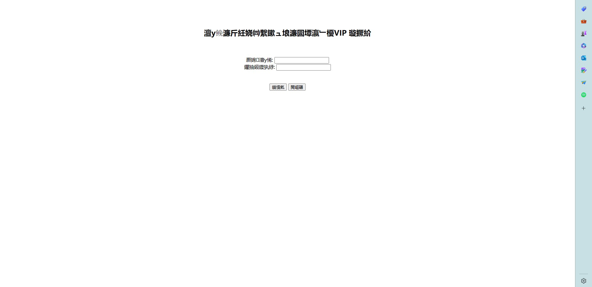

# 1. 网页输入http://192.168.233.129/test.html，服务器应该返回404并打印相关信息，但服务器未输出任何信息。--20230613

原因：Ubuntu 10 以后，1024以下的端口默认关闭。
解决：修改端口号为9991，同时网页输入http://192.168.233.129:9991/test.html，服务端返回了如下信息：

```
client ip: 192.168.233.1	 port : 64353
read line : GET /qiniu.html HTTP/1.1
read line : Host: 192.168.233.129:8080
read line : Connection: keep-alive
read line : Cache-Control: max-age=0
read line : Upgrade-Insecure-Requests: 1
read line : User-Agent: Mozilla/5.0 (Windows NT 10.0; Win64; x64) AppleWebKit/537.36 (KHTML, like Gecko) Chrome/114.0.0.0 Safari/537.36
read line : Accept: text/html,application/xhtml+xml,application/xml;q=0.9,image/avif,image/webp,image/apng,*/*;q=0.8,application/signed-exchange;v=b3;q=0.7
read line : Accept-Encoding: gzip, deflate
read line : Accept-Language: zh-CN,zh;q=0.9,en;q=0.8
read line : 
client ip: 192.168.233.1	 port : 64354
read line : GET /qiniu.html HTTP/1.1
read line : Host: 192.168.233.129:8080
read line : Connection: keep-alive
read line : Cache-Control: max-age=0
read line : Upgrade-Insecure-Requests: 1
read line : User-Agent: Mozilla/5.0 (Windows NT 10.0; Win64; x64) AppleWebKit/537.36 (KHTML, like Gecko) Chrome/114.0.0.0 Safari/537.36
read line : Accept: text/html,application/xhtml+xml,application/xml;q=0.9,image/avif,image/webp,image/apng,*/*;q=0.8,application/signed-exchange;v=b3;q=0.7
read line : Accept-Encoding: gzip, deflate
read line : Accept-Language: zh-CN,zh;q=0.9,en;q=0.8
read line : 
```
# 2. GoogleChrome 空白


# 3. Edge 中文乱码

