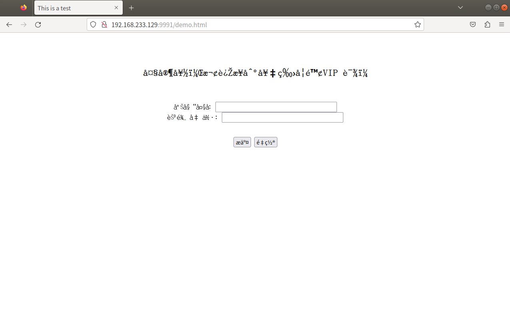

# 1、读取/解析请求模块：Get（本服务器只实现了Get功能）

```cpp
// 处理 http 请求
void do_http_request(client_sock);
close(client_sock);

// 读取一行，以换行符结束
int get_line(int sock, char *buf, int size);

// 读取请求方法method
!isspace(buf[j])
    
// 只处理Get请求
strncasecmp(method, "GET", i) == 0
    
// debug:调试时将值置为1，可以打印调试信息
static int debug = 1;

// 读取url
!isspace(buf[j])

// 继续读取 http 头部并打印出来
// 非GET请求的处理
    
// 定位服务器本地的html文件
// 处理 url 中的 '?'
path
```

# 2、响应模块：200 写死响应内容

```cpp
void do_http_response(int client_sock, const char *path);
```

# 3、处理文件不存在：404

```cpp
struct stat st;
stat(path, &st);

void not_found(int client_sock);//404 
fprintf(stderr, "send reply failed. reason: %s\n", strerror(errno));

// 响应模块：根据path返回
}else {//文件存在

    if(S_ISDIR(st.st_mode)){
        strcat(path, "/index.html");
    }

    do_http_response(client_sock, path);

// do_http_response模块的两部分
void do_http_response(int client_sock, const char *path) {
	int ret = 0;
	FILE *resource = NULL;
	
	resource = fopen(path, "r");
	
	if (resource == NULL) {
		not_found(client_sock);
		return ;
	}
	
	//1.发送 http 头部
	ret = headers(client_sock, resource);
	
	//2.发送 http body
	if(!ret){
	    cat(client_sock, resource);
	}
	
	fclose(resource);
}
```

# 4、其他响应方法

```cpp
void unimplemented(int client_sock);//501：请求方法未实现
void bad_request(int client_sock);  //400：请求格式错误
void inner_error(int client_sock);  //500：服务器内部错误
```

# 5、并发处理

```cpp
ubuntu安装telnet协议：https://blog.csdn.net/czjnoe/article/details/122150420
一、安装telnet客户端

sudo  apt-get install  telnet
二、安装telnet服务端

sudo  apt-get install  telnetd
三、安装网络守护进程

sudo  apt-get install  openbsd-inetd   
四、安装xinetd

sudo  apt-get  install  xinetd
五、重启telnet服务

sudo  /etc/init.d/xinetd   restart
六、查看服务，显示服务器正在监听

netstat  -a  | grep  telnet
--------------------------------------
telnet 127.0.0.1 9991
```

```cpp
#include <pthread.h>
--------------------------------------
/*处理 http 请求,读取客户端发送的数据*/
//do_http_request(client_sock);

//启动线程处理 http 请求
int* pclient_sock = NULL;
pclient_sock = (int *)malloc(sizeof(int));
*pclient_sock = client_sock;

pthread_create(&id, NULL, do_http_request, (void *)pclient_sock);
--------------------------------------
// 在do_http_request中释放内存
close(client_sock);
if (pclient_sock) free(pclient_sock);	//释放动态分配的内存

return NULL;
```

# 6、编译

```cpp
g++ TinyHttpServer.cpp -pthread -o TinyHttpServer
```

# 7、Bug处理

## 1. 网页输入http://192.168.233.129/test.html，服务器应该返回404并打印相关信息，但服务器未输出任何信息。--20230613

原因：Ubuntu 10 以后，1024以下的端口默认关闭。
解决：修改端口号为9991，同时网页输入http://192.168.233.129:9991/test.html，服务端返回了如下信息：

```
client ip: 192.168.233.1	 port : 64353
read line : GET /qiniu.html HTTP/1.1
read line : Host: 192.168.233.129:8080
read line : Connection: keep-alive
read line : Cache-Control: max-age=0
read line : Upgrade-Insecure-Requests: 1
read line : User-Agent: Mozilla/5.0 (Windows NT 10.0; Win64; x64) AppleWebKit/537.36 (KHTML, like Gecko) Chrome/114.0.0.0 Safari/537.36
read line : Accept: text/html,application/xhtml+xml,application/xml;q=0.9,image/avif,image/webp,image/apng,*/*;q=0.8,application/signed-exchange;v=b3;q=0.7
read line : Accept-Encoding: gzip, deflate
read line : Accept-Language: zh-CN,zh;q=0.9,en;q=0.8
read line : 
client ip: 192.168.233.1	 port : 64354
read line : GET /qiniu.html HTTP/1.1
read line : Host: 192.168.233.129:8080
read line : Connection: keep-alive
read line : Cache-Control: max-age=0
read line : Upgrade-Insecure-Requests: 1
read line : User-Agent: Mozilla/5.0 (Windows NT 10.0; Win64; x64) AppleWebKit/537.36 (KHTML, like Gecko) Chrome/114.0.0.0 Safari/537.36
read line : Accept: text/html,application/xhtml+xml,application/xml;q=0.9,image/avif,image/webp,image/apng,*/*;q=0.8,application/signed-exchange;v=b3;q=0.7
read line : Accept-Encoding: gzip, deflate
read line : Accept-Language: zh-CN,zh;q=0.9,en;q=0.8
read line : 
```

## 2. GoogleChrome 空白


## 3. Edge 中文乱码


## 4. 火狐中文乱码

